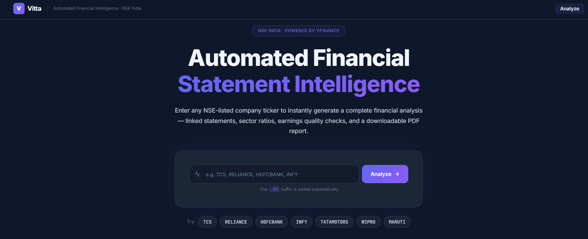
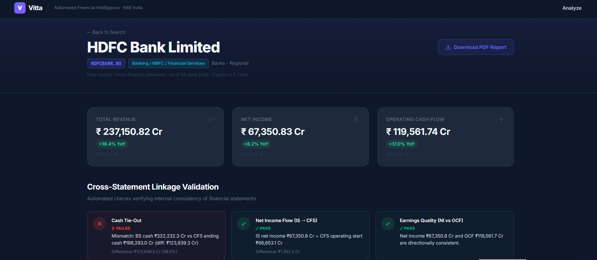
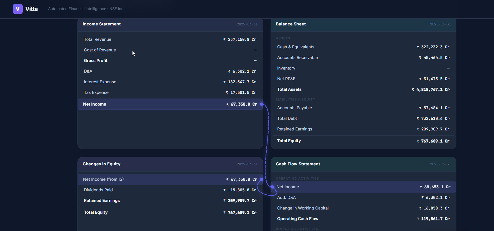
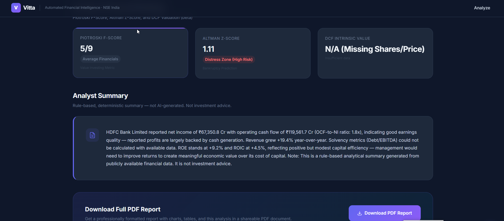

<div align="center">



<br/><br/>

# Vitta — Automated Financial Statement Intelligence Platform

**A complete, locally-runnable web platform for automated financial statement analysis of NSE-listed Indian companies.**  
No paid APIs. No subscriptions. Just Python.

<br/>

[](https://python.org)
[](https://flask.palletsprojects.com)
[](https://ai.google.dev)
[](https://supabase.com)
[](https://github.com/ranaroussi/yfinance)
[](https://docker.com)

</div>

---

## ✨ What's New

> Vitta has evolved from a standalone financial viewer into a full **AI-powered financial intelligence platform**. Here's everything that has been added:

| Feature | Description |
|---|---|
| 🤖 **Gemini AI Chat** | Streaming AI assistant powered by Gemini 2.5 Flash, context-aware with live financial data |
| 📊 **Piotroski F-Score** | 9-point value investing signal calculated from real financial statement data |
| 🏦 **Altman Z-Score** | Bankruptcy prediction model with Safe / Grey / Distress zone classification |
| 💰 **DCF Valuation** | Intrinsic value per share + margin of safety using historical free cash flow |
| 🗄️ **Supabase Integration** | Cloud database backend storing financial data for 75+ NSE tickers |
| ⚡ **GitHub Actions Sync** | Automated nightly sync of financial data to Supabase via `curl_cffi` |
| 🐳 **Docker & Gunicorn** | Production-ready containerization with Gunicorn WSGI server |
| 🔐 **Environment Config** | `.env`-driven secrets management via `python-dotenv` |

---

## 📸 Screenshots

<div align="center">

### Dashboard — KPI Cards & Cross-Statement Linkage Validation


<br/><br/>

### Connected Financial Statements with Animated Linkage Lines


<br/><br/>

### Advanced Financial Models — Piotroski, Altman Z-Score & DCF


<br/><br/>

### Gemini AI Financial Chat — Context-Aware Streaming Responses


<br/><br/>

### Supabase Cloud Database — 75+ NSE Tickers Cached


</div>

---

## 🚀 Quick Start

```bash
# 1. Clone the repository
git clone https://github.com/your-username/vitta.git
cd "Vitta  Automated Financial Statement Intelligence Platform"

# 2. Create and activate a virtual environment
python -m venv .venv
.venv\Scripts\activate          # Windows
# source .venv/bin/activate     # macOS/Linux

# 3. Install dependencies
pip install -r requirements.txt

# 4. Configure environment variables
cp .env.example .env
# Edit .env with your keys (see Configuration section below)

# 5. Run the app
python app.py

# 6. Open your browser
# http://localhost:5000
```

> Try entering: `TCS`, `RELIANCE`, `HDFCBANK`, `INFY`, `TATAMOTORS`

---

## 🧠 Core Features

### 📈 Connected Financial Statements Animation

The centrepiece of Vitta — a 2×2 grid of all four financial statements with **animated cross-statement linkage lines**:

| Linkage Button | What It Visualises |
|---|---|
| **Net Income** | Income Statement → Cash Flow Statement (indirect method start) → Equity retained earnings |
| **Depreciation** | IS D&A line → CFS add-back |
| **Working Capital** | BS Accounts Receivable / Payable → CFS working capital adjustment |
| **Dividends** | CFS Financing → Equity dividends → BS retained earnings |
| **Cash Tie-Out** | CFS ending cash → BS Cash & Equivalents |

Clicking any button **highlights the relevant rows** and draws an **animated dashed cubic-bezier SVG line**, dynamically positioned from `getBoundingClientRect`. A `ResizeObserver` redraws lines on window resize.

---

### ✅ Cross-Statement Linkage Validation

Three automated audit checks with **Pass / Fail / Unable to Verify** status:

| Check | Logic |
|---|---|
| **Cash Tie-Out** | Ending CFS cash ≈ BS Cash & Equivalents (5% tolerance) |
| **Net Income Flow** | IS Net Income ≈ CFS Operating Section start |
| **Earnings Quality** | Flags if Net Income is positive but Operating Cash Flow is negative |

---

### 🤖 Gemini AI Financial Chat *(New)*

A floating chat sidebar powered by **Gemini 2.5 Flash** (`gemini-2.5-flash`):

- **Context-aware**: Automatically loaded with the company's financial data, sector ratios, Piotroski score, Altman Z-Score, DCF valuation, and analyst summary
- **Streaming responses**: Real-time SSE (Server-Sent Events) stream so answers appear word by word
- **Markdown rendering**: Bold, italic, and line breaks rendered inline
- **Thinking indicator**: Animated "Thinking..." state while the model processes

```python
# Powered by: google-generativeai >= 0.5.2
# Model: gemini-2.5-flash (streaming)
# Route: POST /api/chat
```

---

### 📊 Advanced Financial Models *(New)*

#### Piotroski F-Score (9-point)
A quantitative value-investing signal covering:
- **Profitability**: ROA > 0, OCF > 0, Change in ROA, Accruals (OCF > NI)
- **Leverage & Liquidity**: Change in Leverage, Change in Current Ratio
- **Operating Efficiency**: Change in Gross Margin, Change in Asset Turnover

**Interpretation**: Score ≥ 7 = Strong, 4–6 = Average, ≤ 3 = Weak

#### Altman Z-Score
Classic bankruptcy prediction model:

```
Z = 1.2(T1) + 1.4(T2) + 3.3(T3) + 0.6(T4) + 1.0(T5)
```

| Zone | Score | Meaning |
|---|---|---|
| 🟢 Safe Zone | > 2.99 | Low bankruptcy risk |
| 🟡 Grey Zone | 1.81 – 2.99 | Moderate risk |
| 🔴 Distress Zone | < 1.81 | High bankruptcy risk |

#### DCF Intrinsic Valuation
Simple but robust Discounted Cash Flow model:
- Uses average historical Free Cash Flow (OCF + CapEx)
- Projects 5 years with terminal growth rate (3%)
- Discounts at WACC (10%)
- Outputs **intrinsic value per share** and **margin of safety %**

---

### 🗄️ Supabase Cloud Database *(New)*

Financial data for **75+ top NSE tickers** is pre-fetched and stored in Supabase for fast lookups, reducing dependency on live Yahoo Finance calls:

```
financial_data table
├── ticker (text, primary key)
├── info (jsonb)         — Company metadata, market cap, etc.
├── income_statement (jsonb)
├── balance_sheet (jsonb)
└── cash_flow (jsonb)
```

Configure in `.env`:
```env
SUPABASE_URL="https://your-project-id.supabase.co"
SUPABASE_KEY="your-supabase-service-role-key"
GEMINI_API_KEY="your-google-gemini-api-key"
```

---

### ⚡ Automated Data Sync — GitHub Actions *(New)*

`scripts/sync_supabase.py` runs on a **nightly GitHub Actions cron job** to keep Supabase fresh:

- Fetches all 75 NSE tickers from Yahoo Finance
- Uses **`curl_cffi`** to spoof Chrome's TLS fingerprint, bypassing Cloudflare blocks on cloud/CI environments
- Upserts JSON blobs into Supabase with retry logic
- Logs progress for CI visibility

---

### 📑 Sector-Appropriate Ratios

Config-driven sector classification — **adding a new sector requires only a dict entry**, no code changes:

| Bucket | Key Ratios |
|---|---|
| Technology / IT | Gross Margin, Revenue Growth |
| Manufacturing / FMCG | Inventory Turnover, Gross Margin, ROA |
| Energy / Telecom | Debt/Equity, CapEx % Revenue, EV/EBITDA |
| Banking / NBFC | Net Interest Margin, ROE, Leverage Ratio |
| All sectors | ROE, ROIC, Debt/EBITDA |

---

### 📄 Downloadable PDF Reports

Professional-grade PDF reports built with **ReportLab Platypus**:
- Executive summary callout block
- Cross-statement validation table
- Sector ratios table
- **Advanced models section**: Piotroski, Altman Z-Score, DCF
- matplotlib trend chart embedded as PNG
- Footer: data source disclosure, date, not-investment-advice note

---

## 🏗️ Architecture

```
vitta/
├── app.py                  Flask entry point, routes, AI chat endpoint
├── .env                    Secrets (Supabase + Gemini keys)
├── Dockerfile              Docker + Gunicorn production config
├── requirements.txt        All pip dependencies
│
├── data/
│   ├── fetcher.py          yfinance wrappers — income, balance, cashflow, info
│   ├── transform.py        INR → ₹ Crore normalization, YoY % change
│   ├── validation.py       Cross-statement linkage checks
│   ├── sectors.py          Sector classification + ratio engine
│   ├── narrative.py        Rule-based analyst narrative generator
│   └── models.py           Piotroski F-Score, Altman Z-Score, DCF Valuation ⭐NEW
│
├── scripts/
│   └── sync_supabase.py    Nightly GitHub Actions data sync to Supabase ⭐NEW
│
├── templates/
│   ├── base.html           Shared layout: nav, fonts, Chart.js CDN, chat widget
│   ├── index.html          Ticker input / landing page
│   ├── dashboard.html      Full analysis dashboard (models, chat, linked stmts)
│   └── error.html          Friendly error page
│
├── static/
│   ├── css/
│   │   ├── style.css       Core design system (dark, fintech aesthetic)
│   │   └── chat.css        AI chat sidebar styles ⭐NEW
│   └── js/
│       ├── dashboard.js    Chart.js initialization
│       ├── connections.js  Connected statements SVG animation engine
│       └── chat.js         Gemini AI chat SSE streaming handler ⭐NEW
│
├── reports/
│   └── generator.py        ReportLab PDF (now includes models section) ⭐UPDATED
│
└── images/                 Screenshots for README ⭐NEW
```

### Data Flow

```
User enters ticker
      ↓
fetcher.py  →  raw yfinance DataFrames (income, balance, cashflow, info)
      ↓
transform.py → normalized dicts in ₹ Crore + YoY changes
      ↓
validation.py → cross-statement linkage checks (pass/fail/unable_to_verify)
      ↓
sectors.py  →  sector classification + ratio computation
      ↓
models.py   →  Piotroski F-Score + Altman Z-Score + DCF Valuation  ⭐NEW
      ↓
narrative.py → deterministic, template-based analyst note
      ↓
dashboard.html (Jinja2) + Chart.js + connections.js + chat.js
      ↓  (optionally)
reports/generator.py → ReportLab PDF with matplotlib chart + models section
      ↓  (AI chat)
POST /api/chat → Gemini 2.5 Flash (streaming SSE) ⭐NEW
```

---

## ⚙️ Configuration

### Environment Variables

Copy `.env.example` to `.env` and fill in your keys:

```env
# Supabase (optional — for cloud data caching)
SUPABASE_URL="https://your-project-id.supabase.co"
SUPABASE_KEY="your-supabase-service-role-key"

# Google Gemini AI (optional — for AI chat feature)
GEMINI_API_KEY="your-google-gemini-api-key"

# Flask
PORT=5000
DEBUG=true
```

> **Note:** The app runs fully without Supabase or Gemini keys — it falls back to live yfinance calls, and the AI chat button simply shows a configuration error.

### Caching

Flask-Caching SimpleCache (in-memory, **5-minute TTL**) is applied per ticker. To disable during development:

```python
app.config["CACHE_DEFAULT_TIMEOUT"] = 0
```

### Adding a New Sector

Edit `data/sectors.py` — no other code changes needed:

```python
SECTOR_MAPPING.append(("your sector string", "my_bucket"))

SECTOR_CONFIG["my_bucket"] = {
    "label": "My New Sector",
    "ratios": ["gross_margin", "return_on_equity"],
}
```

---

## 🐳 Docker Deployment

```bash
# Build the image
docker build -t vitta .

# Run with your environment variables
docker run -p 5000:5000 \
  -e GEMINI_API_KEY="your-key" \
  -e SUPABASE_URL="your-url" \
  -e SUPABASE_KEY="your-key" \
  vitta
```

The container runs **Gunicorn** (production WSGI server) on `0.0.0.0:5000`.

---

## 🛠️ Tech Stack

| Layer | Technology |
|---|---|
| Web Framework | Flask 3.x + Jinja2 |
| Data Source | yfinance ≥ 0.2.51 |
| Data Processing | pandas 2.2, numpy 1.26 |
| Caching | Flask-Caching (SimpleCache) |
| Charts (Browser) | Chart.js 4.x via CDN |
| Animations | Vanilla JavaScript + SVG |
| AI Chat | Google Gemini 2.5 Flash (streaming SSE) |
| Database | Supabase (PostgreSQL + REST API) |
| PDF Reports | ReportLab Platypus |
| PDF Charts | matplotlib (Agg backend) |
| TLS Bypass | curl_cffi ≥ 0.7.0 (Chrome fingerprint spoof) |
| Production Server | Gunicorn ≥ 21.2 |
| Containerization | Docker (python:3.11-slim) |
| Fonts | Inter + JetBrains Mono (Google Fonts) |
| Secrets Management | python-dotenv |

---

## 📊 Data Source: yfinance

**yfinance is the primary data source.** No Alpha Vantage, no Financial Modeling Prep, no paid API keys required.

### Coverage Notes for Indian Stocks

| Category | Coverage |
|---|---|
| Large-cap NSE (Nifty 50) | Generally good — 3–4 years of annual statements |
| Mid-cap NSE | Moderate — some fields may be missing or renamed |
| Small-cap NSE | Thin — common to hit "unable to verify" on validation checks |
| Quarterly data | Not used — Vitta uses annual statements only |
| CFS ending cash balance | Often missing → cash tie-out shows "unable to verify" |
| NIM for banks | Proxy used — yfinance doesn't cleanly separate interest income |
| EV/EBITDA | Only available when yfinance populates `enterpriseValue` |

### Field Name Variance Handling

`transform.py` uses a **candidate list approach** — each canonical field has an ordered list of possible yfinance labels. The first match wins. If none match, the field returns `None` and the UI displays `—` gracefully without crashing.

---

## 🧪 Tested Tickers

| Ticker | Sector | Cash Tie-Out | NI Flow | Earnings Quality |
|---|---|:---:|:---:|:---:|
| TCS.NS | Technology | ✅ | ✅ | ✅ |
| RELIANCE.NS | Energy | — | ✅ | ✅ |
| HDFCBANK.NS | Banking | ❌ | ✅ | ✅ |
| TATAMOTORS.NS | Manufacturing | — | ✅ | ✅ |
| INFY.NS | Technology | ✅ | ✅ | ✅ |
| WIPRO.NS | Technology | — | ✅ | ✅ |
| MARUTI.NS | Manufacturing | — | ✅ | ✅ |

> ✅ Pass &nbsp;|&nbsp; ❌ Fail &nbsp;|&nbsp; — Unable to Verify (data gap in yfinance)

---

## ⚠️ Disclaimer

> Data source: Yahoo Finance via yfinance. All figures are in **₹ Crore**.  
> For **informational and educational purposes only** — this is **not investment advice**.  
> Accuracy of financial data depends entirely on yfinance's coverage for the specific ticker.  
> Advanced models (Piotroski, Altman Z-Score, DCF) are approximations and should not be used as the sole basis for any investment decision.

---

<div align="center">

Build by Narendra Bhandari 

</div>
